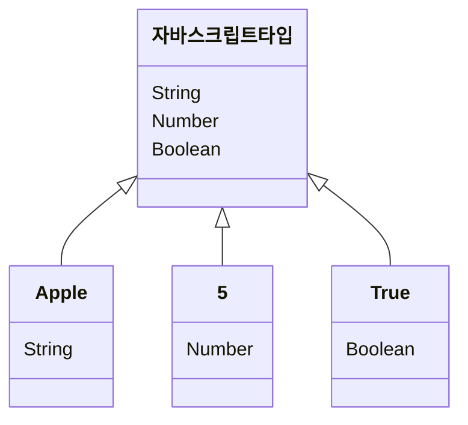

# test

```mermaid
		classDiagram
	    자바스크립트 타입 <|-- Apple
	    자바스크립트 타입 <|-- 5
	    자바스크립트 타입 <|-- True
	    자바스크립트 타입 : String 
	    자바스크립트 타입 : Number
	    자바스크립트 타입: Boolean
	    class Apple{
	      String
	    }
	    class 5{
	      Number
	    }
	    class True{
	      Boolean
	    }
```
